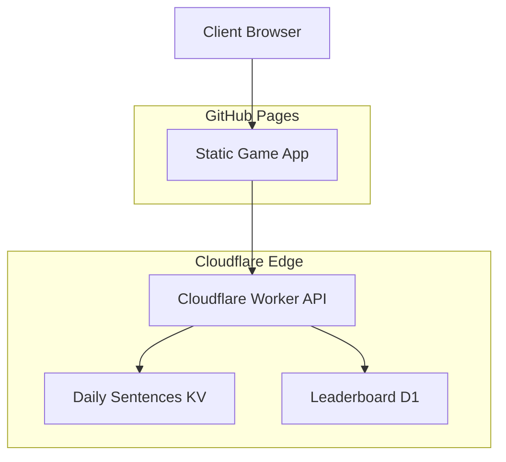

# Design Document

## Overview

The "Guess the Sentence" game is a TypeScript-based web application designed for 5th grade students. The game combines word puzzle mechanics with a sophisticated scoring system that rewards consecutive correct guesses through compounding multipliers. The application will be deployed as a static site on GitHub Pages while maintaining security for daily sentences and providing persistent leaderboard functionality.

## Architecture

### High-Level Architecture



### Deployment Strategy

Since GitHub Pages only supports static hosting, the architecture separates concerns:

- **Static Frontend**: TypeScript game logic, UI components, and game mechanics hosted on GitHub Pages
- **Cloudflare Workers**: Serverless API endpoints for sentence delivery and leaderboard operations
- **Cloudflare D1**: SQL database for structured leaderboard data and player statistics
- **Cloudflare KV**: Key-value store for daily sentences with built-in TTL and global edge caching
- **Build Process**: GitHub Actions to compile TypeScript, bundle assets, and deploy to GitHub Pages

## Components and Interfaces

### Core Game Components

#### GameEngine
- **Purpose**: Central game state management and rule enforcement
- **Responsibilities**:
  - Initialize daily game session
  - Process letter guesses and update game state
  - Calculate scores with compounding multiplier logic
  - Detect game completion
- **Key Methods**:
  - `initializeGame(date: string): Promise<void>`
  - `processGuess(letter: string): GuessResult`
  - `calculateScore(letter: string, instances: number): number`
  - `isGameComplete(): boolean`

#### SentenceManager
- **Purpose**: Handle sentence retrieval and letter matching
- **Responsibilities**:
  - Fetch daily sentence from secure API
  - Track revealed/hidden letters
  - Validate letter guesses against sentence
- **Key Methods**:
  - `loadDailySentence(date: string): Promise<string>`
  - `revealLetter(letter: string): number`
  - `getDisplaySentence(): string`
  - `isLetterInSentence(letter: string): boolean`

#### ScoreCalculator
- **Purpose**: Implement the compounding multiplier scoring system
- **Responsibilities**:
  - Track consecutive correct guesses
  - Calculate points with multiplier progression
  - Reset multiplier on incorrect guesses
- **Key Methods**:
  - `calculatePoints(letterInstances: number, isCorrect: boolean): number`
  - `updateMultiplier(isCorrect: boolean): void`
  - `getCurrentMultiplier(): number`
  - `resetStreak(): void`

#### UIController
- **Purpose**: Manage user interface interactions and display updates
- **Responsibilities**:
  - Render on-screen keyboard
  - Update sentence display
  - Show score and streak information
  - Handle game completion flow
- **Key Methods**:
  - `renderKeyboard(): void`
  - `updateSentenceDisplay(sentence: string): void`
  - `updateScore(score: number, streak: number): void`
  - `showCompletionDialog(): void`

### External Service Interfaces

#### Cloudflare Workers API
- **Purpose**: Serverless API endpoints for game data operations
- **Implementation**: Cloudflare Workers with TypeScript
- **Security Features**:
  - Server-side sentence selection based on date
  - Rate limiting with Cloudflare's built-in protection
  - CORS configuration for GitHub Pages domain
- **Endpoints**:
  - `GET /api/sentence/{date}`: Returns daily sentence from KV store
  - `POST /api/scores`: Submit daily score to D1 database
  - `GET /api/leaderboard`: Retrieve top players from D1 database

#### Cloudflare KV Store
- **Purpose**: Fast, globally distributed storage for daily sentences
- **Implementation**: Key-value pairs with date-based keys
- **Features**:
  - Global edge caching for fast sentence retrieval
  - TTL support for automatic cleanup of old sentences
  - Encrypted storage with Cloudflare's security
- **Data Structure**:
  - Key: `sentence:{YYYY-MM-DD}`
  - Value: JSON with sentence content and metadata

#### Cloudflare D1 Database
- **Purpose**: SQL database for structured leaderboard and player data
- **Implementation**: SQLite-compatible database at the edge
- **Features**:
  - ACID transactions for score updates
  - SQL queries for leaderboard rankings
  - Automatic replication across Cloudflare's network
- **Schema**:
  - `players` table: player_name, cumulative_score, games_played, last_played
  - `daily_scores` table: player_name, game_date, daily_score, created_at

## Data Models

### Game State Model
```typescript
interface GameState {
  currentSentence: string;
  revealedLetters: Set<string>;
  guessedLetters: Set<string>;
  score: number;
  streakMultiplier: number;
  consecutiveCorrect: number;
  isComplete: boolean;
  gameDate: string;
}
```

### Score Calculation Model
```typescript
interface ScoreResult {
  pointsEarned: number;
  newTotal: number;
  multiplierUsed: number;
  letterInstances: number;
  isCorrect: boolean;
}
```

### Leaderboard Model
```typescript
interface LeaderboardEntry {
  playerName: string;
  cumulativeScore: number;
  gamesPlayed: number;
  lastPlayedDate: string;
}
```

### API Response Models
```typescript
interface SentenceResponse {
  sentence: string;
  date: string;
  difficulty: string;
}

interface ScoreSubmission {
  playerName: string;
  dailyScore: number;
  gameDate: string;
}
```

## Error Handling

### Client-Side Error Handling
- **Network Failures**: Graceful degradation with cached sentences for offline play
- **API Timeouts**: Retry logic with exponential backoff
- **Invalid Input**: Input validation and user-friendly error messages
- **State Corruption**: Game state recovery and reset mechanisms

### Security Error Handling
- **Sentence Tampering**: Validate sentence integrity with checksums
- **Score Manipulation**: Client-side validation with server-side verification
- **Rate Limiting**: Handle API rate limits with user notifications

### User Experience Error Handling
- **Loading States**: Show progress indicators during API calls
- **Fallback Content**: Default sentences if API is unavailable
- **Error Recovery**: Clear error states and allow game restart

## Testing Strategy

### Unit Testing
- **Score Calculation**: Test multiplier logic with various guess sequences
- **Sentence Processing**: Verify letter revelation and completion detection
- **State Management**: Test game state transitions and persistence
- **Input Validation**: Test keyboard input handling and validation

### Integration Testing
- **API Integration**: Test sentence retrieval and leaderboard submission
- **End-to-End Flows**: Complete game sessions from start to finish
- **Cross-Browser**: Ensure compatibility across modern browsers
- **Mobile Responsiveness**: Test touch interactions and responsive design

### Security Testing
- **Sentence Security**: Verify sentences cannot be extracted from client code
- **Score Validation**: Test that scores cannot be artificially inflated
- **API Security**: Validate rate limiting and input sanitization

### Performance Testing
- **Load Times**: Ensure fast initial page load and sentence retrieval
- **Memory Usage**: Test for memory leaks during extended play sessions
- **API Response Times**: Verify acceptable response times for all endpoints